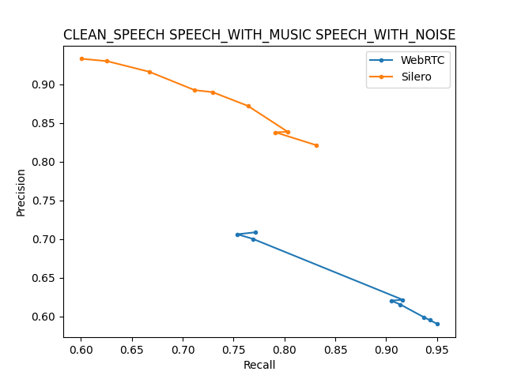

# VAD Benchmark
Benchmarking different VAD models on AVA-Speech dataset:
    - Website: http://research.google.com/ava/download.html#ava_speech_download
    - Paper: https://arxiv.org/pdf/1808.00606.pdf

## Dataset

You can download & pre-process audio from AVA-Speech dataset using the
following bash script:
```
$ cd dataset
$ bash download_ava_speech.sh
```

## Models
The following are the list of the available VAD models:

- **WebRTC**: https://github.com/wiseman/py-webrtcvad
- **Silero**: https://github.com/snakers4/silero-vad
- **auditok**: https://github.com/amsehili/auditok
- **pyannote:** https://github.com/pyannote/pyannote-audio/blob/develop/tutorials/voice_activity_detection.ipynb
- **Nvidia's Marblenet**: https://github.com/NVIDIA/NeMo/blob/main/tutorials/asr/Voice_Activity_Detection.ipynb
- **SpeechBrain**: https://huggingface.co/speechbrain/vad-crdnn-libriparty#perform-voice-activity-detection
- **Voice Activity Detection Project:** https://github.com/filippogiruzzi/voice_activity_detection
- ~~**PicoVoice Cobra**: https://github.com/Picovoice/cobra. [WEB-BASED]~~

Inside the `vads` directory, you will find a script for each model. This is how
to use a VAD model (e.g `WebRTC`) to trim silence in a given audio file
`samples/example_48k.wav` and write out the result in another audio file:
```python
from os.path import dirname, abspath, join
    
print("Running WebRTC Vad")
samples_dir = join(dirname(dirname(abspath(__file__))), "samples")
audio_filepath = join(samples_dir, "example_48k.wav")
audio, sr = load_audio(audio_filepath)

vad = WebRTC()
audio, sr = vad.trim_silence(audio, sr)
save_audio(audio, sr, "webrtc_example_48k.wav")
```

## Benchmakring

To benchmark any group of vad models against AVA-Speech, all you have to do
is to run the `evaluate.py` script like so:
```bash
python evaluate.py \
    --dataset-path /private/home/anwarvic/VAD_Benchmark/dataset/ava_speech \
    --vad-models Silero WebRTC \
    --window-sizes-ms 48 64 96 \
    --agg-thresholds 0.3 0.6 0.9 \
    --speech-labels CLEAN_SPEECH SPEECH_WITH_MUSIC SPEECH_WITH_NOISE
```
This command will benchmark two VAD models (`Silero` & `WebRTC`) on AVA-Speech
dataset with three different window sizes: `[48, 64, 96]`ms and three
different aggressiveness threshold
(the higher the value is, the less sensitive the VAD gets): `[0.3, 0.6, 0.9]`

To know all available arguments that you can use, run the following command:
```
python evaluate.py --help

usage: evaluate.py [-h] --dataset-path DATASET_PATH [--speech-labels [SPEECH_LABELS ...]] --vad-models [{WebRTC,Silero,SpeechBrain} ...] --window-sizes-ms [WINDOW_SIZES_MS ...]
                   --agg-thresholds [AGG_THRESHOLDS ...] [--out-path OUT_PATH] [--num-workers NUM_WORKERS]

options:
  -h, --help            show this help message and exit
  --dataset-path DATASET_PATH
                        Relative/Absolute path where AVA-Speech audio files are located.
  --speech-labels [SPEECH_LABELS ...]
                        List (space separated) of the true labels (case-sensitive) that we are considering as 'speech'.
  --vad-models [{WebRTC,Silero,SpeechBrain} ...]
                        List of vad models to be used.
  --window-sizes-ms [WINDOW_SIZES_MS ...]
                        List of window-sizes (in milliseconds) to be used.
  --agg-thresholds [AGG_THRESHOLDS ...]
                        List of aggressiveness thresholds to be used. The higher the value is, the less sensitive the model gets.
  --out-path OUT_PATH   Relative/Absolute path where the out labels will be located.
  --num-workers NUM_WORKERS
                        Number of workers working in parallel.
```
This will result in a P/R curve that looks like the one shown below:
<div align="center">
    
</div>


## TODO

- [ ] create test cases.
- [ ] create viz function for VAD.